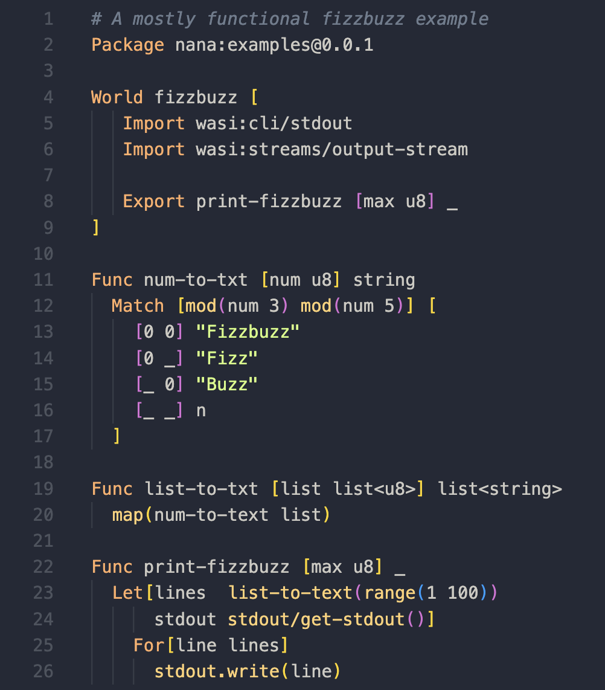

# Nana

Nana is a simple, dynamically typed, interpreted language. It is designed to be
easy to learn and use. The Nana interpreter runs as a WebAssembly component.

To get a feel for what Nana programs look like here is an example Fizzbuzz
implementation:

If you'd like to learn more please read [the language
tutorial]([https://logaan.github.io/nana.wasm.rs/repl/) written in the [Learn X in Y
minutes](https://learnxinyminutes.com) style. For a more formal look at the
language there are [Railroad diagrams describing Nana's
grammar](docs/grammar/index.md)
