**Grammar:**

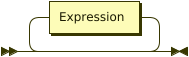

```
Grammar  ::= Expression*
```

**Expression:**

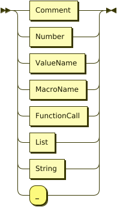

```
Expression
         ::= Comment
           | Number
           | ValueName
           | MacroName
           | FunctionCall
           | List
           | String
           | '_'
```

referenced by:

* FunctionCall
* Grammar
* List

**Comment:**

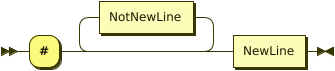

```
Comment  ::= '#' NotNewLine* NewLine
```

referenced by:

* Expression

**Number:**

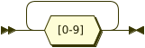

```
Number   ::= [0-9]+
```

referenced by:

* Expression

**ValueName:**

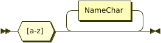

```
ValueName
         ::= [a-z] NameChar*
```

referenced by:

* Expression
* FunctionCall

**MacroName:**


```
MacroName
         ::= [A-Z] NameChar*
```

referenced by:

* Expression

**FunctionCall:**

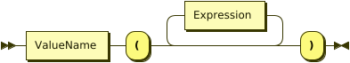

```
FunctionCall
         ::= ValueName '(' Expression* ')'
```

referenced by:

* Expression

**List:**

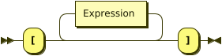

```
List     ::= '[' Expression* ']'
```

referenced by:

* Expression

**String:**

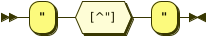

```
String   ::= '"' [^"] '"'
```

referenced by:

* Expression

**NewLine:**

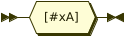

```
NewLine  ::= #xA
```

referenced by:

* Comment

**NotNewLine:**

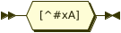

```
NotNewLine
         ::= [^#xA]
```

referenced by:

* Comment

## 
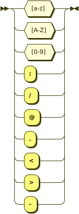 <sup>generated by [RR - Railroad Diagram Generator][RR]</sup>

[RR]: https://www.bottlecaps.de/rr/ui